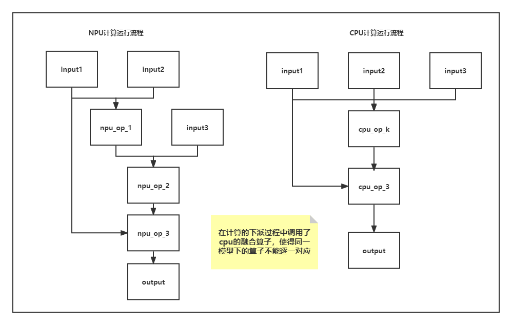

# ptdbg_ascend
# **PyTorch精度对比和溢出检测工具使用指南**

## **使用场景**

在同一模型或算子调试过程中，遇到算子相关的计算精度问题，定位时费时费力，所以推出了一个精度比对工具。

精度对比工具，通过在PyTorch模型中注入hook，跟踪计算图中算子的前向传播与反向传播时的输入与输出，排查存在计算精度误差，进行问题的精准定位。

主要的使用场景包括：

- 同一模型，从cpu(或gpu)移植到npu中存在精度下降问题，对比npu芯片中的算子计算数值与cpu/gpu芯片中的算子计算数值，进行问题定位。
- 同一模型，进行迭代(模型、算子或设备迭代)时存在的精度下降问题，对比相同模型在迭代前后版本的算子计算数值，进行问题定位。

## **例外场景**
1. 当前dump只会dump tensor类型数据，且会判断tensor是否为浮点类型，只Dump浮点型。
2. 只支持dump反向调用链路中的算子，如果不在链路中会出现只有前向没有反向dump数据的情况。

## **精度比对基本原理**

普遍适用的方法是以模型为单位，采用hook机制挂在模型的上。当模型在CPU上进行正向传播时跟踪并dump每一层的数值输入与输出，在反向传播时跟踪并dump每一层的梯度输入值与输出值；同样的当模型在NPU中进行计算时采用相同的方式记录下相应的数据，通过对比dump出的数值，计算余弦相似度和均方根误差的方式,
定位和排查NPU算子存在的计算精度问题。

精度比对工具dump数据说明：在实际使用场景中网络模型通常较大，基于整网全量数据的dump，耗时长且储存文件大。因此内部默认使用部分网络参数和统计量的方式dump数据来提升效率。如需dump全量数据，请将register_hook函数中的sample参数设为False（默认为True）。


图1即为精度对比的基本逻辑，思路清晰明了，但其中存在较多的细节问题：

1. 需要对大量的变量进行控制，要确保模型结构参数等相同。
2. 相同的模型在不同的硬件设备上进行运算时可能会出现相同的计算会调用不同的底层算子，造成npu算子可能出现的不匹配情形。
3. NPU与CPU/GPU的计算结果误差可能会随着模型的执行不断累积，最终会出现同一个算子因为输入的数据差异较大而无法匹配对比计算精度的情况。
4. 该比对机制是以GPU/CPU侧api输入输出为标杆数据，进行比对。因此对于NPU侧自研api，无法找到对应的标杆数据，因此该机制暂不支持此场景的数据dump与比对。

其中细节问题2可能表现如下图2：



由于可能会出现融合算子，所以在算子的逐一匹配时可能会出现错误匹配或无法匹配的问题，例如图2中NPU算子npu_op_1与npu_op_2无法和cpu_op_k进行匹配，才去跳过的方式，直到到npu_op_3和cpu_op_3才从新对齐开始匹配。

### **算子匹配条件**

判断运行在cpu和npu上的两个算子是否相同采用的步骤如下：

1. 两个算子的名字是否相同
1. 两个算子的输入输出Tensor数量和各个Tensor的shape是否相同

通常满足以上的两个条件，就认为是同一个算子，成功进行算子的匹配，后续进行相应的计算精度比对。

### **NPU自定义算子dump**
对于NPU vs NPU场景，本工具还支持对NPU自定义算子的数据dump，目前支持列表如下

| NPU自定义算子 |
| ------ | 
| torch_npu.one_ | 
| torch_npu.npu_sort_v2 | 
| torch_npu.npu_transpose |
| torch_npu.npu_broadcast |
| torch_npu.npu_dtype_cast |
| torch_npu.empty_with_format |
| torch_npu.npu_one_hot |
| torch_npu.npu_stride_add |
| torch_npu.npu_ps_roi_pooling |
| torch_npu.npu_roi_align |
| torch_npu.npu_nms_v4 |
| torch_npu.npu_iou |
| torch_npu.npu_nms_with_mask |
| torch_npu.npu_pad |
| torch_npu.npu_bounding_box_encode |
| torch_npu.npu_bounding_box_decode |
| torch_npu.npu_batch_nms |
| torch_npu.npu_slice |
| torch_npu._npu_dropout |
| torch_npu.npu_indexing
| torch_npu.npu_ifmr |
| torch_npu.npu_max |
| torch_npu.npu_scatter |
| torch_npu.npu_layer_norm_eval |
| torch_npu.npu_alloc_float_status |
| torch_npu.npu_get_float_status |
| torch_npu.npu_clear_float_status |
| torch_npu.npu_confusion_transpose |
| torch_npu.npu_bmmV2 |
| torch_npu.fast_gelu |
| torch_npu.npu_sub_sample |
| torch_npu.npu_deformable_conv2d |
| torch_npu.npu_mish |
| torch_npu.npu_anchor_response_flags |
| torch_npu.npu_yolo_boxes_encode |
| torch_npu.npu_grid_assign_positive |
| torch_npu.npu_normalize_batch |
| torch_npu.npu_masked_fill_range |
| torch_npu.npu_linear |
| torch_npu.npu_bert_apply_adam |
| torch_npu.npu_giou |
| torch_npu.npu_ciou |
| torch_npu.npu_ciou_backward |
| torch_npu.npu_diou |
| torch_npu.npu_diou_backward |
| torch_npu.npu_sign_bits_pack |
| torch_npu.npu_sign_bits_unpack |

### **计算精度评价指标**

在进行计算精度匹配时，基本共识为默认CPU或GPU的算子计算结果是准确的，最终比对生成的csv文件中主要包括以下的几个属性：
| Name  | Npu Tensor Dtype | Bench Tensor Dtype | Npu Tensor Shape | Bench Tensor Shape | Cosine | RMSE  | MAPE  |
| :---: | :--------------: | :----------------: | :--------------: | :----------------: | :----: | :---: | :---: |

其中主要使用算子Name、Dtype、Shape用于描述算子的基本特征，Cosine(余弦相似)、RMSE(均方根误差)、MAPE(绝对百分比误差)作为评价计算精度的主要评估指标：

1. 余弦相似度(通过计算两个向量的余弦值来判断其相似度)：

$$
   \Large
   cos(\theta) = \frac{\sum_{i=1}^{n} (\hat{y_{i}} \times y_{i})}
   {\sqrt{\sum_{i=1}^{n}\hat{y_{i}}} \times \sqrt{\sum_{i=1}^{n}y_{i}^{2}}}
$$
当余弦夹角数值越接近于1说明计算出的两个张量越相似，在计算中可能会存在nan，主要由于可能会出现其中一个向量为0

2. 均方根误差(RMSE)：

$$
    \Large
    RMSE = \sqrt{\frac{1}{n} \sum_{i=1}^{n} (\hat{y_{i}} - y_{i})^{2}}
$$
当均方根误差越接近0表示其计算的平均误差越小

3. 平均绝对百分比误差(MAPE)：

$$
    \Large 
    MAPE = \frac{1}{n} \sum_{i=1}^{n}|\frac{\hat{y_{i}} - y_{i}}{y_{i}}|
$$
绝对百分比误差衡量计算误差的百分比，越接近0越好，但当其中的实际计算结果中存在0时是无法进行计算的


## 环境准备

安装了Pytorch 1.8 或者 Pytorch 1.11版本的Linux系统。

- Linux OS

## 安装

### 从源码安装

您可以从源代码构建 ptdbg_ascend 软件包并将其安装在带NPU或者GPU的AI计算环境上。
> ptdbg_ascend 与 Pytorch 有严格的版本配套关系，从源码构建前，您需要确保已经正确安装了[Pytorch v1.8 或 V1.11 版本](https://www.pytorch.org) 。

#### 下载源码

```
git clone https://gitee.com/ascend/tools.git
cd tools/ptdbg_ascend
```

#### 配置安装环境

```BASH
bash ./configure
```

默认情况下，执行上述命会弹出如下的交互式会话窗口
> 您的会话可能有所不同。

```BASH
Please specify the location of python with available pytorch v1.8/v1.11 site-packages installed. [Default is /usr/bin/python3]
(You can make this quiet by set env [ADAPTER_TARGET_PYTHON_PATH]):
```

此时，要求您输入安装了 Pytorch v1.8或者v1.11 版本的python解释器路径，如果默认路径是正确的，直接回车，否则请输入正确的 python 解释器路径。
> 您可以通过设置 ADAPTER_TARGET_PYTHON_PATH的环境变量，来抑制交互式窗口弹出，但是要确保路径是有效的，否则，仍然会要求您输入正确的 python 解释器路径。

键入后，会耗费几秒钟以确保您的输入是有效的，配置完成后会输出如下提示信息。
```BASH
Configuration finished
```

#### 配置cmake

> 根据您的网络状况，可能需要数分钟来下载ptdbg_ascend的依赖项目以完成配置。

```
mkdir build
cd build
cmake ..
```

#### 执行编译

> 您应当根据实际编译环境，设置合适的并发编译数以提升编译速度。

```BASH
make -j8
```

编译结束后，安装包会生成在

```
./ptdbg_ascend/dist/ptdbg_ascend-0.1-py3-none-any.whl
```

#### 安装

您可以继续执行

```BASH
make install
```

将ptdbg_ascend安装到配置时指定的 python 解释器包目录下，或者使用 pip3 安装 ptdbg_ascend 到您期望的位置。

```
pip3 install ./ptdbg_ascend/dist/ptdbg_ascend-0.1-py3-none-any.whl --upgrade --force-reinstall
```

#### 接口函数

接口函数用于dump过程的配置，如下：

| 函数              | 描述                                                                                                |
|-----------------|---------------------------------------------------------------------------------------------------|
| set_dump_path   | 用于设置dump文件的路径(包含文件名)，参数示例：“/var/log/dump/npu_dump.pkl”                                            |
| set_dump_switch | 设置dump范围，不设置则默认处于关闭状态。第一个参数为：“ON” 或者 "OFF",若需要控制dump的算子范围，则需要第二、三个参数，默认不配置                        |
| seed_all        | 固定随机数，参数为随机数种子，默认种子为：1234.                                                                        |
| register_hook   | 用于注册dump回调函数，例如：注册精度比对hook：register_hook(model, acc_cmp_dump).                                    |
| compare         | 比对接口，将GPU/CPU/NPU的dump文件进行比对，第三个参数为存放比对结果的目录；<br/>文件名称基于时间戳自动生成，格式为：compare_result_timestamp.csv. |
| parse           | (若pkl文件中有)打印特定api接口的堆栈信息、统计数据信息，第一个参数为pkl文件名，第二个参数为要抽取的api接口前缀，例如"21_Torch_norm".                 |

#### 使用说明
1) seed_all和set_dump_path在训练主函数main一开始就调用，避免随机数固定不全；
2) 模型较大时dump较慢，可以通过两步法：先粗->后精，逐步缩小范围来定位，如下：<br/>
   第一步，通过整网Dump做整网比对，快速找到问题的可能点；<br/>
        Dump信息包含完整数据的统计信息：dtype, shape, max, min, mean等；<br/>
   第二步，基于整网比对找到的精度问题产生起始点/起始点范围，再通过指定api dump，或者指定范围做完整数据dump，从而进行精确分析；
3) 指定范围dump的控制方法：
```
# 初步确定了问题的起始范围后，可以通过如下方式dump单API或者小范围API的全量数据
# 实现方式：通过set_dump_switch的第二、第三个参数控制dump的范围

# 示例1： dump指定api/api列表.
set_dump_switch("ON", mode=2, scope=["1478_Tensor_permute", "1484_Tensor_transpose", "1792_Torch_relue"])

# 示例2： dump指定范围. 会dump 1000_Tensor_abs 到 1484_Tensor_transpose_forward之间的所有api
set_dump_switch("ON", mode=3, scope=["1000_Tensor_abs", "1484_Tensor_transpose_forward"])

# 示例3： STACK模式，只dump堆栈信息， 示例中dump "1000_Tensor_abs" 到 "1484_Tensor_transpose_forward" 之间所有api的STACK信息
set_dump_switch("ON", mode=4, scope=["1000_Tensor_abs", "1484_Tensor_transpose_forward"])

# 示例4： dump指定api/api列表的ACL级别的输入输出数据
set_dump_switch("ON", mode=5, scope=["1000_Tensor_abs", "1484_Tensor_transpose_forward"])
```
4) dump数据存盘说明：<br/>

精度比对dump场景 <br/>
假设配置的dump文件名为npu_dump.pkl，此时dump的结果为两部分：
* 文件npu_dump.pkl 中包含dump数据的api名称、dtype、 shape、统计信息：max, min, mean.<br/>
* 文件夹npu_dump_timestamp，文件夹下为numpy格式的dump数据.<br/>

整网dump和指定范围dump结果的区别：
* 指定范围dump时，npu_dump.pkl 中还包含stack信息<br/>

溢出检测dump场景<br/>
测试不需要配置dump文件名，会在当前目录自动生成：
* 溢出检测的pkl文件名格式为Overflow_info_{timestamp}.pkl，每次溢出时时间戳不同<br/>
  pkl文件中包含dump数据的api名称、dtype、 shape(不包含统计信息max, min, mean)。
* 对应的dump数据存放目录为Overflow_info_{timestamp}，dump数据为完整Tensor数据，存放格式为numpy。

#### 场景化示例
#### 场景1：训练场景的精度问题分析
第一步，整网Dump比对，初步定位异常范围<br/>
数据dump。NPU和GPU/CPU数据，下面以NPU为例（GPU/CPU dump基本相同）：<br/>
```
from ptdbg_ascend import *

# 在main函数开始前固定随机数
seed_all()
# 设置dump路径（含文件名）
set_dump_path("./npu_dump.pkl")

...

# 注册精度比对dump的hook函数
# 第一个参数是model对象， 第二个参数为精度比对dump的钩子函数，必须配置为：acc_cmp_dump，该函数从ptdbg_ascend中import

# 示例
register_hook(model, acc_cmp_dump)

...

# dump默认处于关闭状态，设置dump开关为打开
# 如果只在特定的step dump，则在期望dump的迭代开始前打开dump开关，step结束后关掉。
set_dump_switch("ON")

...

# 在期望dump的step结束后关闭dump开关
set_dump_switch("OFF")

...

```

比对dump数据<br/>
```
from ptdbg_ascend import *

...

# 数据dump完成后,比对dump的NPU vs GPU/CPU数据, compare第二个参数中的目录必须是已存在的目录
比对示例：
dump_result_param={
"npu_pkl_path": "./npu_dump.pkl",
"bench_pkl_path": "./gpu_dump.pkl",
"npu_dump_data_dir": "./npu_dump_20230104_13434",
"bench_dump_data_dir": "./gpu_dump_20230104_132544",
"is_print_compare_log": True
}
compare(dump_result_param, "./output", True)
```
第二步：缩小范围分析<br/>
      指定api范围做完整数据的dump，此时也可以做精度比对。<br/>
      指定范围dump时，还会dump出stack信息，便于找到api调用点。<br/>
      示例代码中只包含第一步基础之上，需要调整的设置。
```
# 设置dump路径（含文件名），dump路径若不重新设置，会导致整网dump的数据被覆盖
set_dump_path("./npu_dump_scope.pkl")

...

# 注册精度比对dump的hook函数，调整dump_step为1，此时为全量dump
register_hook(model, acc_cmp_dump, dump_step=1)

...

# 通过set_dump_switch控制dump的范围
# 示例1： dump指定api/api列表.
set_dump_switch("ON", mode=2, scope=["1478_Tensor_permute", "1484_Tensor_transpose", "1792_Torch_relue"])
# 示例2： dump指定范围. 会dump 1000_Tensor_abs 到 1484_Tensor_transpose_forward之间的所有api
set_dump_switch("ON", mode=3, scope=["1000_Tensor_abs", "1484_Tensor_transpose_forward"])
# 示例3： dump指定api/api列表的ACL级别数据.
register_hook(model, acc_cmp_dump, dump_mode='acl', dump_config='dump.json')
set_dump_switch("ON", mode=5, scope=["1478_Tensor_permute", "1484_Tensor_transpose", "1792_Torch_relue"])
...
```
按范围dump后的分析<br/>
可以基于dump的完整数据做比对，可以结合堆栈信息分析代码，也可以做单API模型的问题复现；

#### 场景2：提取指定API的堆栈信息/dump数据的统计信息
指定范围dump的信息可能包含多个api，且pkl文件显示不直观，这里通过parse接口可以清晰的显示特定api的堆栈信息和dump数据统计信息
```
from ptdbg_ascend import *

# 提取dump信息中第21次调用的API：Torch_batch_normal的堆栈信息及数据统计信息
parse("./npu_dump.pkl", "21_Torch_batch_normal")
```

#### 场景3：溢出检测分析（NPU场景,GPU和CPU不支持）
##### 1. api溢出检测，溢出api，api级数据dump
```
from ptdbg_ascend import *

# 在main函数起始位置固定随机数
seed_all()

...

#注册溢出检测的hook：
# 第一个参数是model对象， 第二个参数为精度比对dump的钩子函数名，必须配置为：overflow_check，该函数从ptdbg_ascend中import
# 第三个参数为溢出检测的次数，例如配置为3，表示检测到第三次溢出时停止训练;

# 示例，检测到2次溢出后退出
register_hook(model, overflow_check, overflow_nums=2)

...
```
##### 2. api溢出检测，溢出api，acl级数据dump
```
from ptdbg_ascend import *

# 在main函数起始位置固定随机数
seed_all()

...

#注册溢出检测的hook：
# 第一个参数是model对象， 第二个参数为精度比对dump的钩子函数名，必须配置为：overflow_check，该函数从ptdbg_ascend中import
# 第三个参数为overflow_nums表示第几次溢出时，进行acl算子级dump，例如配置为3，表示检测到第三次溢出时停止训练，并针对此次溢出dump;默认不配置即检测到一次溢出，训练停止
# 第四个参数为dump_mode,控制针对溢出api的dump模式，默认api，如需进一步定位acl数据，可配置为dump_mode="acl"
# 第五个参数为dump_config，acl dump的配置文件，dump_mode="acl"时，此配置项为必须的。例如：dump_config='/home/xxx/dump.json'

# 示例，检测到1次溢出后退出，并针对溢出api，进行对应acl粒度的数据dump
register_hook(model, overflow_check, dump_mode='acl', dump_config='/home/xxx/dump.json')

...
```
##### dump.json配置示例
```
{
 "dump":
 {
         "dump_list":[],
         "dump_path":"/home/HwHiAiUser/dump/output",
         "dump_mode":"all",
         "dump_op_switch":"on"
 }
}
```
##### dump.json参数说明
| 字段名              | 说明                                                                                                |
|-----------------|---------------------------------------------------------------------------------------------------|
| dump_list   | 待dump数据的算子模型。为空，无需配置。                                         |
| dump_path   | dump数据文件存储到运行环境的目录，支持配置绝对路径或相对路径：<br>* 绝对路径配置以“/”开头，例如：/home/HwHiAiUser/output。<br>* 相对路径配置直接以目录名开始，例如：output。<br>例如：dump_path配置为/home/HwHiAiUser/output，则dump数据文件存储到运行环境的/home/HwHiAiUser/output目录下。 |
| dump_mode   | dump数据模式，配置如下：<br>* output：dump算子的输出数据，默认取值output。<br>* input：dump算子的输入数据。<br>*  all：dump算子的输入、输出数据。|
| dump_op_switch   | 单算子模型dump数据开关，配置如下：<br>* off：关闭单算子模型dump，默认取值off。<br>* on：开启单算子模型dump。|

##### dump路径说明
采集的dump数据会在{dump_path}/{time}/{deviceid}/{model_id}目录下生成，例如“/home/HwHiAiUser/output/20200808163566/0/0”
```
├── 20230131172437
│   └── 1
│       ├── 0
│       │   ├── Add.Add.45.0.1675157077183551
│       │   ├── Cast.trans_Cast_0.31.0.1675157077159449
│       │   ├── Cast.trans_Cast_5.43.0.1675157077180129
│       │   ├── MatMul.MatMul.39.0.1675157077172961
│       │   ├── Mul.Mul.29.0.1675157077155731
│       │   ├── NPUAllocFloatStatus.NPUAllocFloatStatus.24.0.1675157077145262
│       │   ├── TransData.trans_TransData_1.33.0.1675157077162791
│       │   └── TransData.trans_TransData_4.41.0.1675157077176648
│       ├── 1701737061
│       │   └── Cast.trans_Cast_2.35.0.1675157077166214
│       ├── 25
│       │   └── NPUClearFloatStatus.NPUClearFloatStatus.26.0.1675157077150342
│       └── 68
│           └── TransData.trans_TransData_3.37.0.1675157077169473
```
##### 注意事项
此功能原理是，针对溢出阶段，开启acl dump模式，重新对溢出阶段执行，落盘数据。
* dump_mode="acl"场景下，会增加npu的内存消耗，请用户谨慎开启。
* 针对前向溢出api，可以通过以上原理，重新精准执行到溢出前向api，因此可以得到前向溢出api的全部acl数据。
* 部分api存在调用嵌套关系，比如functional.batch_norm实际调用torch.batch_norm, 该场景会影响acl init初始化多次，导致功能异常。针对此场景，后续会针对性做适配，当前版本可能存在此问题
* 针对反向场景，通过以上原理，由于torch反向自动化机制，只能重新执行loss.backward（即反向入口），因此得到的是反向全流程的acl数据。
* 针对前向溢出api，可以通过overflow_nums，配置允许的溢出次数，并将每次溢出api的全部acl数据dump下来，到达指定溢出次数后停止。
* 针对反向溢出场景的特殊性，overflow_nums不生效，反向检测到一次溢出后，就会停止，并将反向全流程acl数据dump。

## 贡献

push代码前，请务必保证已经完成了基础功能测试和网络测试！

## Release Notes

Release Notes请参考[RELEASE](RELEASE.md).
